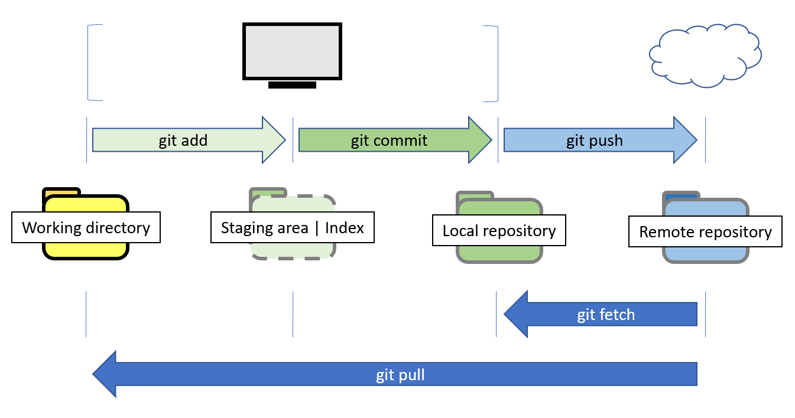

# Git kommandon
Gudien förutsätter att du har installerat programvaran Git (git-scm.com). I exemplet används sajten GitHub.com, och för exempel på kod i guiden används repo: https://github.com/andsju/Example.
GitHub page https://andsju.github.io/Example/

Versionshantering med Git hanteras i 3 olika referenser. I din lokala mapp **Working directory** finns filer och mappar, **Index** refererar till ngt som är förberett för en förändring. Den tredje referensen är **Local repository** (**Head**). Den pekar på den senaste slutgiltiga förändringen. 

När *Local repository* och *Remote repository* är överensstämmande har du en identiskt kopia.


___
### Skapa ett nytt repo
I din dator:
* Skapa en ny mapp
* Öppna mappen  

Ange kommandot *git init*

```markdown
git init
```
Nu har du skapat ett lokalt **git repo**. En dold mapp med namnet  __.git__ bevakar innehållet i mappen. 
___

### Visa aktuell status för ett repo

Ange kommandot *git status*

```markdown
git status
```
___

### Koppla ett lokalt repo till en server 
Ta reda på sökvägen till det repo som ska kopplas, *remote server*. 
Lägg till sökvägen med kommandot *git remote add*:

```markdown
git remote add origin <server>
<!-- Exempel -->
git remote add origin https://github.com/andsju/Example
```
___

### Klona ett repo
Skapa en kopia av ett repo med kommandot *git clone*:
```markdown
git clone <server>
<!-- Exempel -->
git clone https://github.com/andsju/Example
```
___


### Lägg till innehåll
Skapa en ny fil i ditt lokala git repo, ex *something.txt*
Ange sedan att filen ska finnas i versionshanteringen med kommandot *git add*:

```markdown
git add something.txt
```

För att lägga till flera filer som skapats | förändrats, ange en punkt: *git add .*

```markdown
git add .
```

När filen (filer) lagts till (redigerats) ska förändringar markeras som klara för överföring. Det görs med kommandot *git commit*. Växeln *-m* beskriver förändringen.

```markdown
git commit -m "First commit"
```
___

### Skicka innehåll till server
Skicka / pusha innehållet som finns din lokala version med kommandot *git push*

```markdown
git push origin master
```
___

### Skapa en ny branch
I Git är **master** den branch som allt utgår ifrån. Att lägga till en branch är ett sätt att göra det möjligt för en eventuell förändring av ett repo. Förändringen kan senare integreras (mergas) med **master**.

För att skapa en ny branch anges ett namn efter kommandot *git branch*. Exemeplvis en branch med namnet ex *fix1*
```markdown
git branch fix1
```
___

### Byt branch
En branch aktiveras med checkout, ex *master*
```markdown
git checkout master
```
Eller branch *fix1* (om den finns)
```markdown
git checkout fix1
```

___

### Visa branch
Visa branches med kommandot *git branch* 
```markdown
git branch
```
___

### Hämta förändringar från remote server
Förändringar som finns hämtas med *git pull*: 
```md
git pull
```

___

## Exempel på arbetsgångar
Klona ett repo, lägg till branch, pusha branch, gör en pull request 
repo: https://github.com/andsju/GitCMDs

#### Steg 1 
Skapa en lokal mapp som du kan arbeta i. Öppna mappen.

#### Steg 2 
Klona repo så att du har en lokal arbetskopia   

```markdown
git clone https://github.com/andsju/Example
```
Kontrollera att status är korrekt.
```markdown
git status
```
(Visas en annan status, kontrollera att du arbetat i rätt mapp. Du kan byta mapp med kommandon cd, *change directory*)

Skapa branch, ex med namnet '*perhaps*'
```markdown
git branch perhaps
```
Växla till branch 'perhaps'

```markdown
git checkout perhaps
```
* Skapa en fil, ex 'headings.md'
* Redigera filen 

Lägg till filen så att den versionhanteras, beskriv förändringen och pusha till repot
```markdown
git add headings.md
git commit -m "Added file headings.md"
git push -u origin perhaps
```
#### Steg 3 
Nu kan du skapa en pull request på GitHub. 
* Visa det repo på Github dit branchen pushades
* Kontrollera att du ser din branch, klicka på branch
* Leta efter valet 'Pull request'
* Ange en kommentar för Pull request